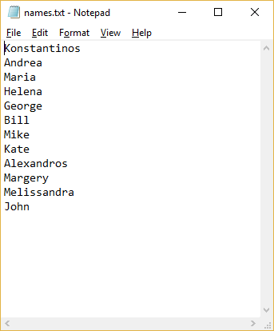
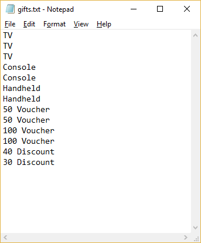
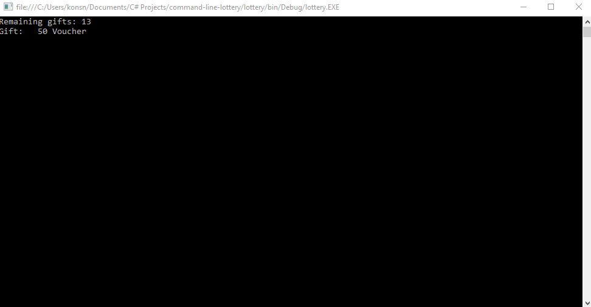
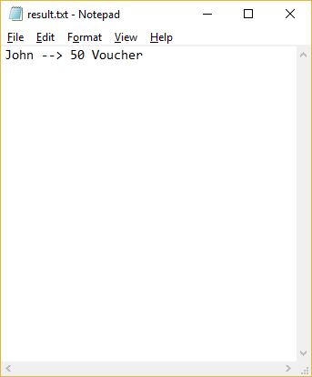

# README #

Lottery program working in command line.

### What is this repository for? ###

Requires two txt files in the executable folder.

* gifts.txt - Contains the available gifts.

* names.txt - Contains the participants.

As the program runs it exports a txt file with the results.

### How do I get set up? ###

The project was developed using Microsoft Visual Studio 2015

### Example Use ###

